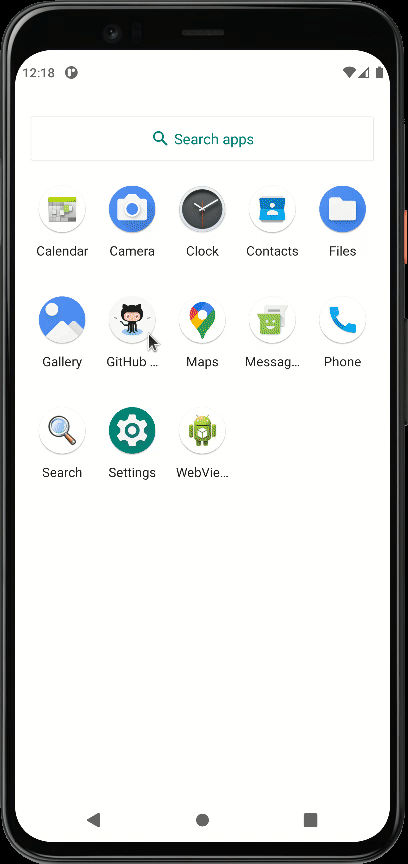
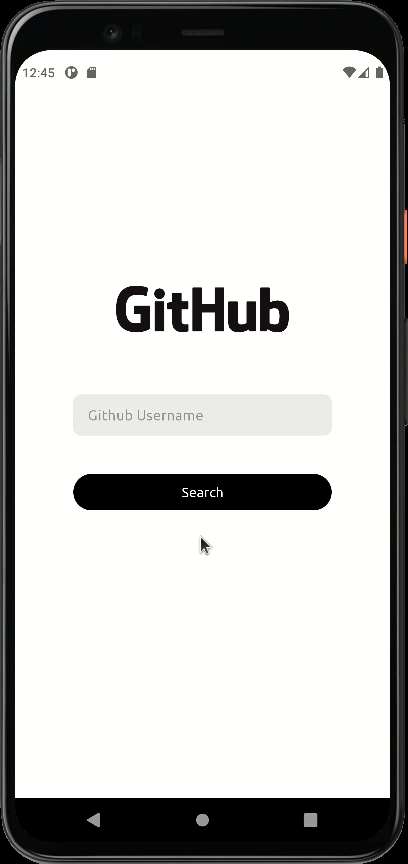
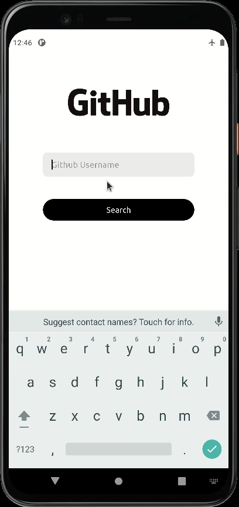

## General

Simple MVVM and REST api base android app to view Github user profile and public repositorys.

<a id="raw-url" href="apk/app-release.apk?raw=true">
</a>

## Specs / Open-source libraries:

- Minimum **SDK 21**, _but AppCompat is used all the way ;-)_
- [**Kotlin**](https://github.com/JetBrains/kotlin) all new modules starting from 2.5.3 will be written in **#Kotlin**.
- [**MVVM**](https://developer.android.com/jetpack/guide) the architecture pattern used in the app (Model-View-ViewModel), that incorporates the Android Architecture Components
- [**Kotlin Coroutines**](https://github.com/Kotlin/kotlinx.coroutines) for coroutines support
- [**ViewModel**](https://developer.android.com/topic/libraries/architecture/viewmodel) for designed to store and manage UI-related data in a lifecycle conscious way.
- [**LiveData**](https://developer.android.com/topic/libraries/architecture/livedata) for observable data
- [**ViewBinding**](https://developer.android.com/topic/libraries/view-binding) for easily interacts with views
- [**Retrofit**](https://github.com/square/retrofit) for constructing the REST API
- [**Gson**](https://github.com/google/gson) for convert Objects into JSON representation or convert json into Object
- [**Glide**](https://github.com/bumptech/glide) for loading images
- [**CircleImageView**](https://github.com/hdodenhof/CircleImageView) for circular ImageView
- [**Toasty**](https://fonts.google.com/specimen/Ubuntu) for animations
- **Android Support Libraries**, the almighty ;-)

## Others:

- [**GitHub Logo**](https://github.com/logos)
- [**Ubuntu Font**](https://github.com/logos)
- [**GitHub API**](https://docs.github.com/en/rest/reference/users)

## Screenshots

|                     Profile Details                     |                           Invalid Username                            |                            No connection                            |
| :-----------------------------------------------------: | :-------------------------------------------------------------------: | :-----------------------------------------------------------------: |
|  |  |  |

## Note: Android Kotlin Gradle Update

Use the updated Gradle version in the `~/gradle/wrapper/gradle-wrapper.properties` file:

```
distributionUrl = https\://services.gradle.org/distributions/gradle-7.0.2-bin.zip
```
